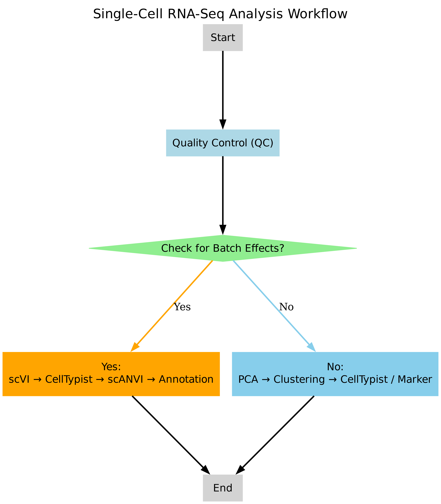

+++
date = '2026-03-09T16:09:29+08:00'
draft = false
title = 'Learning and Practice of Single-Cell Sequencing'
+++

# Materials and Methods
## Learning Resources and Workflow Design

To design an appropriate analysis workflow, the overall strategy was developed based on the guidelines provided by Single Cell Best Practices [^1], with particular emphasis on rigorous data quality assessment, batch effect evaluation, and flexible downstream analysis.

At the beginning of the analysis, potential batch effects were systematically assessed using exploratory data visualization and metadata inspection. This initial evaluation determined whether samples originated from multiple batches or experimental conditions that could introduce technical variation. Based on this assessment, one of two alternative analysis workflows was selected.

When clear batch effects were detected, a latent variable-based integration strategy was adopted using scvi-tools. Specifically, scVI was first applied to learn a batch-corrected latent representation directly from raw count data. To enable reliable cell type annotation, a subset of high-confidence cells was annotated using CellTypist on a log-normalized and highly variable gene-filtered copy of the data. These high-confidence labels were then used to initialize scANVI, which performed semi-supervised learning to propagate cell type annotations across the full dataset while preserving batch correction.

In contrast, when no obvious batch effects were observed, a standard analysis pipeline was employed. This workflow included quality control, normalization, highly variable gene selection, principal component analysis (PCA), neighborhood graph construction, and clustering using the Leiden algorithm. Cell type annotation was subsequently performed using either automated prediction with CellTypist or manual validation against canonical marker genes, depending on data complexity and annotation confidence.

The overall workflow design, including both branches (with and without batch effects), is illustrated in Figure[1](#Fig1). This adaptive workflow design enabled the selection of the most appropriate analytical strategy according to dataset characteristics, ensuring robust batch integration, reliable cell type annotation, and analytical consistency across different single-cell datasets processed during the study.

[^1]: HEUMOS L, SCHAAR A C, LANCE C, et al. Best practices for single-cell analysis across modalities[J/OL]. Nature Reviews Genetics, 2023, 24(8): 550-572. [https://oi.org/10.1038/s41576-023-00586-w](https://oi.org/10.1038/s41576-023-00586-w). DOI: [10.1038/s41576-023-00586-w](10.1038/s41576-023-00586-w).